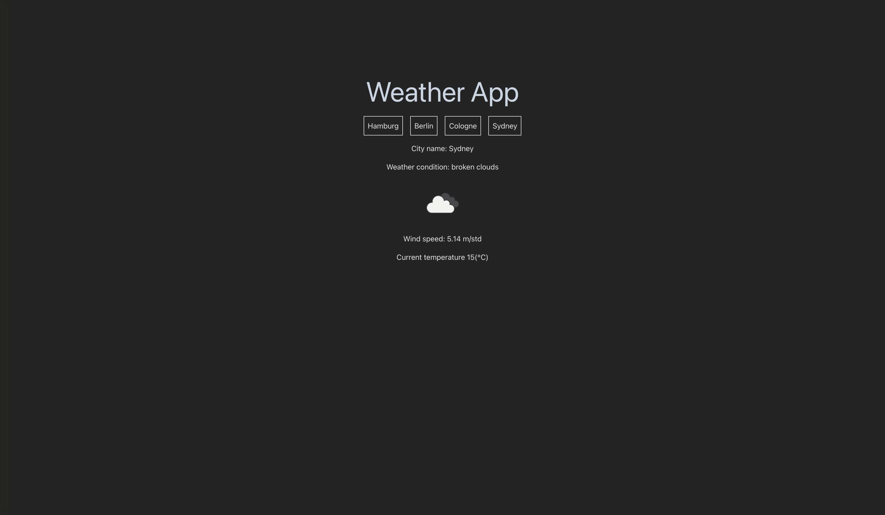

# React Weather API

## Über das Projekt

Dieses Projekt wurde mit React's Fetch und Tailwind CSS entwickelt. Es demonstriert die Verwendung von Fetch und einem modernen CSS-Framework.

## Verwendete Technologien

- React
- Fetch API
- Tailwind CSS

